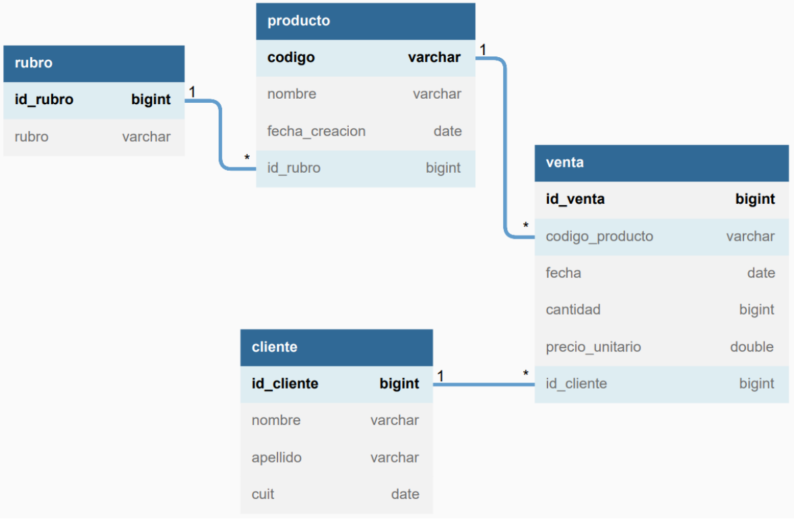

# DuxSoftware SQL challenge
Este repositorio contiene los ejercicios propuestos para la primera parte de la prueba técnica del proceso de selección en DuxSoftware.

Se planteó la siguiente estructura de base de datos:\

A partir de la misma, y para poder evaluar el correcto desempeño de las consultas, se desarrolló el archivo que genera el esquema de esta base de datos titulada `duxdb`.\
Luego, se procedió a poblar la base de datos con datos aleatorios para cada tabla, y, finalmente, en la carpeta `queries` se colocaron las soluciones a cada una de las consultas establecidas con sus respectivos enunciados.

El desarrollo se hizo completamente en SQL utilizando MySQL Workbench.